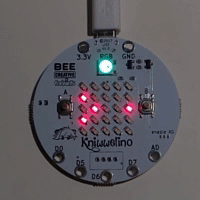

# stau.lu

stau.lu is a program for the [Kniwwelino](http://www.kniwwelino.lu/) that visualises the traffic situation for the highways around [Luxembourg-City](https://www.vdl.lu/).

## Use

After the program has been flashed to the Kniwwelino, the latter only needs to be powered.
Whenever it boots up, it tries to connect to the previously set up WiFi network.
If it fails, the RGB LED will flash in blue, and a WiFi access point called "stau.lu" is set up.
The user needs to connect to the latter with his mobile phone or laptop, and configure WiFi.

If WiFi connection succeeds, the Kniwwelino automatically retrieves the latest traffic information from a server (this may take a few seconds).
After a while, the traffic situation for the first highway section will be displayed (see below).

Button A can be used to cycle through the following 7 sections of the highway around Luxembourg-City:

* Belgium ↔ Croix de Cessange (highway A6) 
* Esch ↔ Croix de Cessange (highway A4) 
* Croix de Cessange ↔ Croix de Gasperich (highway A6) 
* France ↔ Croix de Gasperich (highway A3) 
* Croix de Gasperich ↔ Kirchberg (highway A1) 
* Kirchberg ↔ Germany (highway A1) 
* Mersch ↔ Kirchberg (highway A7) 

Button B toggles the direction. For instance, when "Belgium ↔ Croix de Cessange" is displayed, button B can be used to toggle between the traffic information for "Belgium → Croix de Cessange" and "Croix de Cessange → Belgium".

The RGB LED is used to display the traffic status. It can be one of the following 4 colours:

* Green: fluent traffic, or no information 
* Yellow: some traffic jam (delay ≥ 3 min) 
* Orange: traffic jam (delay ≥ 7 min) 
* Red: severe traffic jam (delay ≥ 15 min) 

## Installation

Before you can use stau.lu, you will need:

* A [Kniwwelino](http://www.kniwwelino.lu/#section-3) and a microUSB cable for connecting it to your computer.
* The latest [Arduino IDE](https://www.arduino.cc/).
  Make sure to configure the Arduino IDE for use with Kniwwelino. See https://doku.kniwwelino.lu/en/installationarduino for more information.

To install stau.lu onto a Kniwwelino, do the following:

* Download or clone this repository to your computer.
* Open the `./handheld/handheld.ino` file with the Arduino IDE.
* Make sure to the Kniwwelino is connected to your computer. Make sure the correct port is selected in the Arduino IDE menu "Tools > Port".
* Click "Upload" to compile and flash the program to your Kniwwelino. This may take several minutes.

## The stau.lu agent

In addition to the stau.lu program for the Kniwwelino, this project contains the source code of the stau.lu agent.
The agent is responsible for retrieving the traffic information from Google Maps, and pushing it to a server where the Kniwwelino can easily retrieve the information.

A stau.lu agent is already running that regularly pushes the latest traffic information to the default Kniwwelino server at `broker.kniwwelino.lu:1883`.
**Average users do not need to set up an agent on their own,** unless they want to become independent from the latter server.
Note that you will need a (free) API key to access the Google Maps API.

The agent is written in Javascript, and can be run using the latest version of [NodeJS](https://nodejs.org/).
To install the agent, do the following:

* Request a (free) API key for the Google Maps Distance Matrix API at https://developers.google.com/maps/documentation/distance-matrix/.
* Download or clone this repository.
* Open the `./agent/` folder and run `npm install` to install all dependencies.
* Open `./agent/default.json` and specify the API key in `googlemapsapi → key`.
  You can also change the server connection configuration here.
* Run `npm start` or `node app` to launch the agent.

The agent will run only once. If you want to continuously push traffic information to a server, consider using a cron job or similar.
**Caution!** The Google Maps API limits the number of requests (at the time of writing: 2,500 requests per day), so make sure that the agent is not run too often.

## License

This project is licensed under the [MIT license](./LICENSE).
That means you are free to use and modify this project as you like, as long as you mention the original author(s).
